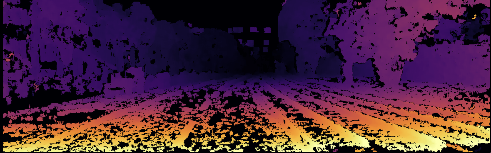
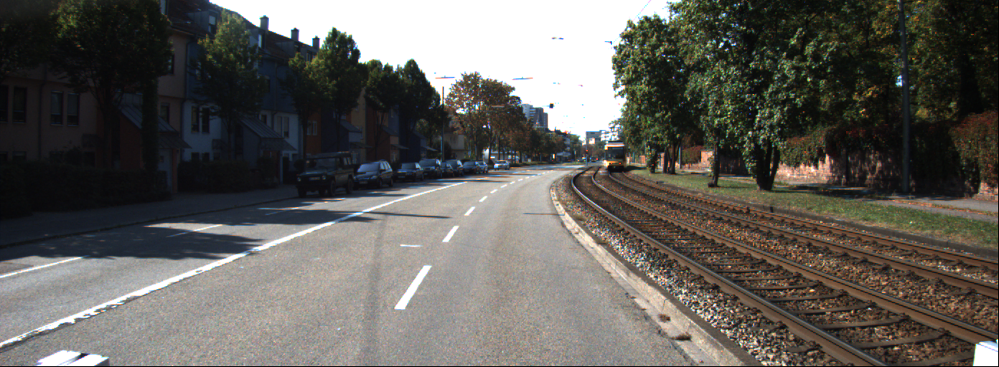

# depthFromStereo
Reconstructs a point cloud from stereo images acquired with the same **calibrated** camera, simply by taking the first shot and moving the camera before taking a second shot of the same scene.
Note that the accuracy of this approach HEAVILY depends on the keypoints found and their matching. That is used to estimate the Fundamental matrix containing all the parameters needed to know the position of one camera with respect to the other.\
It works better with scenes with a high number of distinct features positioned on different planes.

#### Example of reconstructed point cloud using stereo pair from KITTI dataset


#### Disparity map computed from stereo pair



The code is structured in 3 files that need to run in a specific order:

1. `intrinsicParameters.py sourceDirectory` to be called with the name of the directory containing the images you want to use to calibrate the camera (The same camera will be used to acquire the stereo pairs of the scenes to reconstruct). A `intrinsicParameters.npz` file is generated containing the intrinsic parameters of the camera and distortion coefficients found by the camera calibration algorithm using the given images.
(*Once the intrinsic parameters have been computed there is no need to run this again*)

2. `rectifyStereoPair.py --index=IDX [options] -R n` where **IDX** will be the index of the stereo pair located by default in the directory `./stereoPairs/` or `./KITTIPairs/` if `--use-kitti` option is given. (e.g use `rectifyStereoPair.py --index=10 -R 1` if you want to use stereo pair `./StereoPairs/L10.jpg ./StereoPairs/R10.jpg`). The `n` parameter of `-R n` flag indicates which one of the two possibile matrices given as output by SVD to use (`n` can be either `1` or `2`). This writes the parameters that will be used to create the disparity to a file called `stereoDataIDX.npz` in the root directory where **IDX** is the index of the pair given as input. 

    The file contains:

    1. The estimated fundamental matrix using matching pairs of keypoints found in the two images by SIFT.
    2. The essential matrix obtained from the fundamental matrix and the intrinsic paramters matrix (found by `intrinsicParameters.py`)
    3. Rotation matrix **R1** and translation vector **t** (obtained using SVD on the essential matrix)
    4. The (4x4) matrix **Q** used later for reprojection (see opencv documentation `cv::reprojectTo3D` and `cv::stereoRectify`)
    4. The dimensions of the Regions of Interest (the cropped portion of the rectified images containing only image data). If ROIs are not found the rois are set to the entire rectified image.
    
    \
    A rectified version of both shots is written in the root directory in order to be able to perform *Stereo Block Matching* in a simpler way later. The four written files are two color rectified images of the two shots used, and their respective grayscale version. These are visible in the root directory as `rectified{Left/Right}_c.jpg` and `rectfified{Left/Right}.jpg`.
    Sometimes rectification does not work with matrix **R1**, one of the two matrices returned by SVD, a solution can be to substitute **R1** with **R2** (with the `-R n` flag).

    **Options :**\
    `--use-kitti` tells the program that the stereo pair given has to be taken from the `./KITTIPairs/` directory, a special calibration file is used containing the intrinsic parameters given by the KITTI dataset. The fundamental matrix estimatino and subsequent computation of R and T are done in the usual way.\
    `--show-epi` shows epipolar lines drawn on the two images.\
    `--check-epi` computes error using found epipolar lines. (shown as text output).\
    `--show-matches` shows the point matches as circles on the two images connected by lines.\
    `--show-rois` after the rectification procedure shows the cropped portion of the image containing only image data (if it was possible to generate).\
    `--undistort` undistorts the two images of the pair using intrinsic parameters and distortion coefficients and uses a refined version of the intrinsic parameters matrix for the following steps.\
    `--bruteforce nMatches` uses bruteforce matching as matching procedure instead of the default **FLANN**. It uses the best `nMatches` from the total matches found.

3. `depthMap.py index` where `index` will be the index of the stereo pair used when calling `epipolarGeometry.py index`. This generates the disparity map with the aid of a window that allows to adjust the blockMatching algorithm parameters. When the parameters have been configured one can confirm by pressing **esc** on the keyboard. The disparity map produced is then used in conjunction with the matrix **Q** to produce a point cloud `stereoX.ply` where **X** is the index of the pair in exam.

    `depthMap.py path_to_left_img path_to_right_img` is an alternative way to run *depthMap.py*. A disparity image is produced but no reprojection is performed.

If a new `.ply` file has to be generated for an existing `stereoDataX.npz` file It is necessary that the four images `rectified[Left | Right]_c.jpg` and `rectfified[Left | Right].jpg` in the root are the ones relative to the index of the pair the depth map has to be generated for. Otherwise `depthMap.py` will generate a depth map using images that may not correspond to the `stereoData.npz` file. In other wordrs always run `rectifyStereoPair.py` before `depthMap.py index` to avoid mismatches.

### Usage example
##### Camera calibration
```
python intrinsicParameters.py ./CalibrationImages2
```
##### stereoPairRectification
```
python rectifyStereoPair.py --index=10 --show-epi --check-epi --show-matches --show-rois --undistort -R2
```
##### Dense correspondence and depth reconstruction
```
python depthMap.py 10
```
Note that the index of the pair used in step 2 and 3 is the same. Scripts have to run in this order.\
Calibration step has to run only once.
